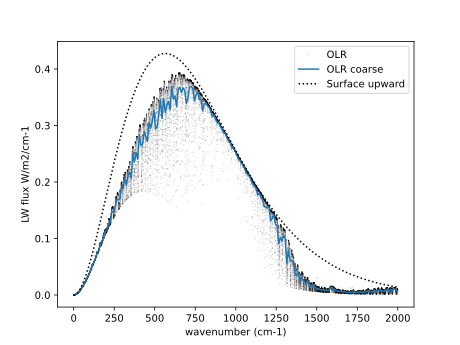
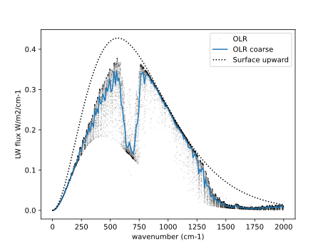

# linepyline

A line-by-line radiative transfer model in pure python -- no C or
Fortran extensions to compile. The code runs fast thanks to [numba](https://numba.readthedocs.io) parallelization, which
gives order-of-magnitude speedup on multi-core CPUs. It produces output in xarray
Dataset format.

linepyline is aimed at climate-oriented problems in Earth and planetary atmospheres. You can
specify the atmosphere to consist of an arbitrary mixture of absorbing gases and
optionally a transparent background gas (dry air or N2). There are functions to compute
mass absorption coefficients and optical depth for the absorbers, and to solve for
longwave (thermal) radiative fluxes using the 2-stream approximation. Shortwave
absorption and scattering will possibly be included in a later release. 

Iinepyline comes with [HITRAN 2024 line lists](http://hitran.org/) for the main isotopes of H2O, CO2, O3, CH3
and NH3, and the [MTCKD 4.3 water vapor continuum
model](http://rtweb.aer.com/continuum_frame.html), all  preinstalled in netCDF format. 

You can download more line lists and convert them to netCDF using the script
`linepyline/HITRAN/HAPI/download_HITRAN_to_netcdf.py` (you may also need to include
thermodynamic data for the added molecules in the gases inventory in `linepyline/phys.py`).

## Quickstart
A quick example to see how it works.
```
import xarray as xr
from matplotlib import pyplot as plt
import linepyline as lpl

# Instantiate a linepyline radiative transfer model 
# This loads line and continuum data
# You only need to do this once at the beginning of the session
rtm = lpl.rtm()

# Open file containing US Standard Atmosphere data for this example
atm = xr.open_dataset('afgl_1986-us_standard.nc')

# Thermodynamic profiles
p = atm.p           # total atmospheric pressure (vertical coordinate), 
                         # must be in Pa and ordered by increasing p
T = atm.t           # atmospheric temperature, must be in K
ps = p.isel(p=-1) # surface pressure (Pa)
Ts = T.isel(p=-1) # surface (skin) temperature (K)

# Concentration of radiatively active species (must be molar fraction, units ppv)
# Try with water vapor only (this will include both the line and continuum spectra; 
# if you want to remove the continuum, set include_mtckd_continuum=False in 
# the call to rmt.radiative_transfer below)
absorbers = {'H2O' : atm.x_H2O}

# Transparent background gas mixed with absorbers
# (just the name, no need to specify a concentration)
background_gas = 'air'

# Spectral resolution and range (cm-1) 
# linepyline will internally create a uniformly-spaced wavenumber grid nu 
dnu = 0.1 
nu_min = dnu
nu_max = 2000

# Line profile to use
# You can choose between 'lorentz', 'voigt' and 'pseudovoigt'
# the latter approximates the voigt profile by a linear combination
# of Lorentzian and Gaussian profiles; the approximation is better than
# 1.2% error and the run time is ~half that of the full Voigt profile
line_shape = 'pseudovoigt'

# Do the calculation -- this will compute mass absorption coefficients, optical depth
# and thermal radiative fluxes. All output is stored in xarray Dataset ds with coordinates (p, nu).
# Runtime for this call is 0.4 s on an 8-core MacBook M3)
ds = rtm.radiative_transfer(nu_min, nu_max, dnu, p, ps, T, Ts, \
       absorbers=absorbers, background_gas=background_gas, line_shape=line_shape)

# Make a spectrally-coarsend version of the output 
# (averages over blocks of width in cm-1)
ds_coarse = rtm.coarsen(ds, dnu, width=10)

# plot
plt.plot(ds.nu, ds.olr, 'k,', alpha=0.2, label='OLR')
plt.plot(ds_coarse.nu, ds_coarse.olr, label='OLR coarse')
plt.plot(ds.nu, ds.lw_up_srf, 'k:', label='Surface upward')
plt.legend()
plt.gca().set_xlabel('wavenumber (cm-1)')
plt.gca().set_ylabel('LW flux W/m2/cm-1');
```

```
# Try it again, now including CO2
# if concentration given as a scalar, 
# it will be assumed uniform (well mixed) through the column
absorbers = {'H2O' : atm.x_H2O,
                   'CO2' : 400*1.e-6}

# Repeat the calculation. This one takes ~1 s -- CO2 has a lot of lines
ds = rtm.radiative_transfer(nu_min, nu_max, dnu, p, ps, T, Ts, a
```


## Installation

-
   [Download](https://docs.github.com/en/get-started/start-your-journey/downloading-files-from-github) or
   [clone](https://docs.github.com/en/repositories/creating-and-managing-repositories/cloning-a-repository?tool=webui)
   this repository

- Install:
```
cd linepyline
pip install .
```

## Dependencies

linepyline requires  (version in parentheses used in developing/testing
the project):
```
python (3.12)
numpy (2.26)
xarray (2025.4.0)
scipy (1.15.1)
numba (0.63.1)
numba-stats (1.11)
```
Using conda, you can install these into your current environment:
```
conda install -c conda-forge numpy xarray scipy numba numba-stats
```
or create a new environment
```
conda create -n linepyline -c conda-forge python=3.12 numpy xarray scipy numba numba-stats
```

## Acknowledgements
linepyline was inspired by Daniel Koll's [PyRADS](https://github.com/danielkoll/PyRADS)
and by Ray Pierrehumbert's book [*Principles of Planetary Climate*](https://geosci.uchicago.edu/~rtp1/PrinciplesPlanetaryClimate) and related python code.


